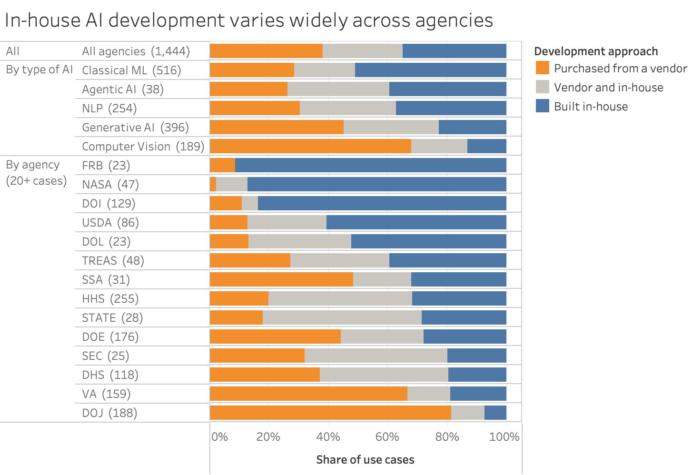
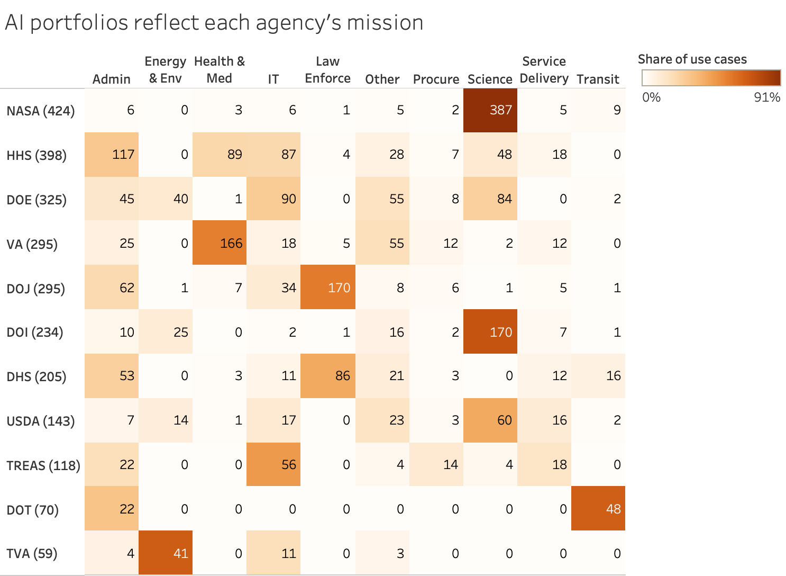
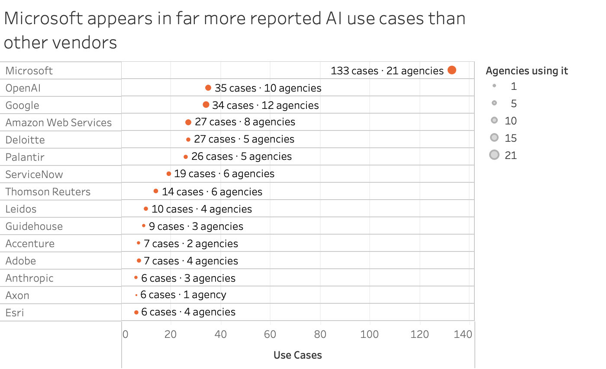

# Who Builds Federal AI?

Vendors, pilots, and the technical workforce, 2024–2026.

Data visualization project for PPOL 5202, Fall 2026.

In 2024, federal agencies hired about 460 technical and data staff a month. From February 2025 to April 2026, they hired about 50 a month. Over the same period, the AI use cases agencies reported to OMB grew from 2,133 to 3,611. Federal AI kept expanding while hiring for the people who build it fell sharply.

That raises a question neither trend answers alone: **who builds the AI that federal agencies run, and does it get past the pilot stage?**

The project uses two public federal sources side by side: the OMB AI Use Case Inventories, for the AI agencies say they run, and OPM Federal Workforce Data, for the technical staff they have to build and run it.

## The three proposal prototypes

**1. Most federal AI involves a vendor, but agencies differ sharply.** Of 1,444 pilot and deployed use cases in 2025, 38% were purchased from a vendor, 27% combined vendor and in-house work, and 35% were built in-house. The Department of Justice bought 81% of its AI; NASA built 87% of its own.



**2. Agencies concentrate their AI in one or two kinds of work.** NASA reported 387 of its 424 classified use cases in science, the Department of Justice 170 of 295 in law enforcement, and the Department of Veterans Affairs 166 of 295 in health and medical work.



**3. One vendor appears far more often than any other.** Microsoft is named in 133 use cases across 21 agencies, ahead of OpenAI (35 cases, 10 agencies) and Google (34 cases, 12 agencies).



The full proposal, including the data viability tables and the semester plan, is in [`proposal/`](proposal).

## What is in this repository

```         
proposal/     the proposal (Word and PDF), the packaged Tableau workbook,
              the chart images above, and the data behind each chart
code/         three R Markdown notebooks that download and build the data
data/         the analysis tables the notebooks produce

Data Access Links GitHub.docx   submission document linking to the two analysis tables
```

Two analysis tables carry the whole project:

| File | One row is |
|------------------------------------|------------------------------------|
| `data/processed/ai_use_cases.csv` | one AI use case in one inventory year (2023, 2024, 2025) |
| `data/processed/workforce.csv` | one count of federal employees: headcount at a snapshot, or hires or exits in a month |

The two are never merged. They measure different things, an AI use case versus a count of people, and an agency-level join would invite a causal reading the data cannot support. The only join is inside the OMB data, linking a 2024 use case to the same use case in 2025 by name. That match is saved as its own file, `data/keys/use_case_link_2024_2025.csv`, so it can be inspected and challenged.

## Reproducing the data

Knit the three notebooks in `code/` in order, from RStudio or the R console:

``` r
rmarkdown::render("code/01_download_data.Rmd")        # download the raw files (~380 MB)
rmarkdown::render("code/02_build_data.Rmd")           # build the two analysis tables
rmarkdown::render("code/03_build_tableau_data.Rmd")   # build the three chart tables
```

The first notebook skips files it has already downloaded, and the months are fixed at January 2024 through July 2026, so a later run reproduces the figures above. OPM revises recent months, so re-downloaded counts can shift slightly; the manifests saved with the raw files record the versions used. Paths are resolved with `here::here()`, so the notebooks run from any working directory. R packages: `tidyverse`, `arrow`, `jsonlite`, `here`, `rmarkdown`.

## Sources

| Source | URL |
|------------------------------------|------------------------------------|
| OPM Federal Workforce Data (EHRI status and dynamics files) | <https://data.opm.gov/get-data/data-downloads> |
| OMB 2025 Federal Agency AI Use Case Inventory | <https://github.com/ombegov/2025-Federal-Agency-AI-Use-Case-Inventory> |
| OMB 2023 and 2024 Federal AI Use Case Inventories | <https://github.com/ombegov/2024-Federal-AI-Use-Case-Inventory> |

## Judgment calls worth knowing about

- **No data file is edited by hand.** Every table in `data/` and `proposal/tableau_data/` is written by a notebook. Only the workbook layout and formatting were set by hand in Tableau.
- **Linking 2024 to 2025 use cases** relies on names, because the inventories share no stable ID. Names that match after normalization are linked outright; the rest are linked when they are at least 80% similar, a threshold chosen by reading sampled pairs. Section A4 of `02_build_data.Rmd` shows that check.
- **The Department of Defense is excluded from the workforce figures.** Several of its components did not submit June and July 2026 data, and the OMB inventories do not cover it either.
- **The 2023 inventory is read as UTF-8 and the 2024 inventory as Windows-1252**, the encodings the files actually use.
